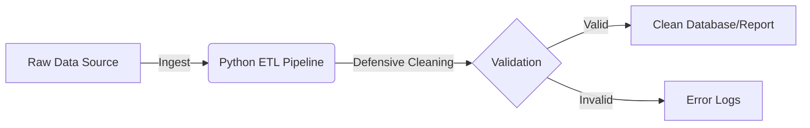

# Subaru Market Data Pipeline 🚗

## Project Overview
This project is a **Production-Ready ETL Pipeline** designed to ingest, clean, and analyze Subaru sales data. It demonstrates advanced Data Engineering patterns including **Defensive Programming**, **Context Management**, and **Environment Security**.

## Key Features
- **Extract:** Ingests raw marketplace data (mocked).
- **Transform:** Defensive data cleaning using Pandas (Type casting & Null handling).
- **Security:** Uses Environment Variables for database credentials.
- **Observability:** Integrated Python logging for audit trails.

## Tech Stack
- **Language:** Python 3.9+
- **Database:** SQLite
- **Libraries:** Pandas, OS, Logging

## Cloud Scaling & Infrastructure
While this version runs locally for demonstration, the architecture is designed for cloud-native deployment:
- **Compute:** The ETL logic is modular, making it ready to be wrapped in an **AWS Lambda** function.
- **Trigger:** In a production environment, this would be triggered by **S3 Event Notifications** whenever a new raw data file is uploaded.
- **Storage:** Cleaned data would be loaded into **AWS Redshift** or **Snowflake** for large-scale analytics.
- **Security:** Secrets are managed via **AWS Secrets Manager** (demonstrated via the `os.getenv` implementation).
## System Architecture

